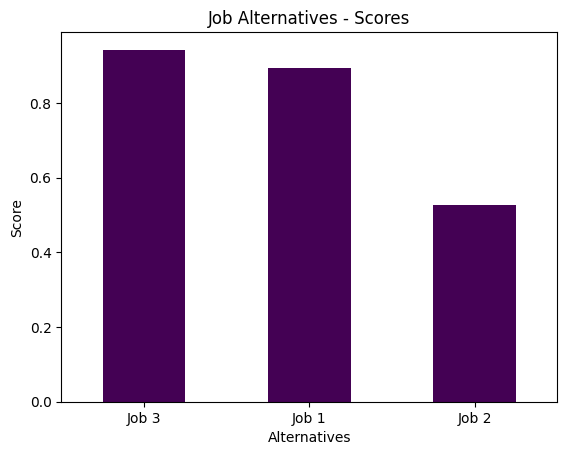
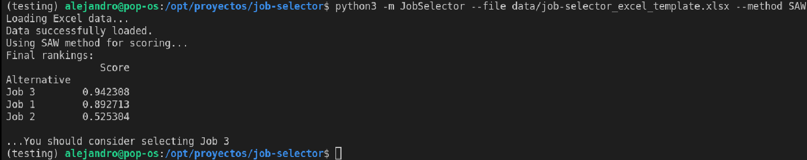

# job-selector

A simple Multi-Attribute Decision Making (MADM) program to help choose a job, for instance.

## Installation
Dependencies:
```bash
pip install pandas numpy openpyxl scikit-learn plotly
```

## Basic theory 

### Introduction
Decision-making processes are an integral part of daily life. While some decisions are straightforward and require little thought, others involve evaluating multiple, often conflicting criteria. In complex scenarios, such as choosing a job or planning a career path, it becomes essential to use structured methods to weigh various factors effectively.

For instance, selecting a job might require considering salary, location, work-life balance, growth opportunities, and other attributes. These criteria are not equally important for everyone, making it crucial to rank and weigh them based on individual preferences. This script aims to streamline that process using a Multi-Attribute Decision Making (MADM) approach.

### Decision-Making Process

1. In general, the decision-making process can be broken into the following eight steps:

2. Define the Problem: Clearly identify the decision to be made. For example, selecting the most suitable job from available options.

3. Determine Requirements: Establish the essential conditions that must be met for any solution to be considered acceptable.

4. Establish Goals: Define what success looks like. These goals may conflict (e.g., higher salary vs. better work-life balance), requiring prioritization.

5. Identify Alternatives: Compile a list of possible options or choices that meet the basic requirements.

6. Define Criteria: Identify and define measurable criteria that will be used to compare and evaluate alternatives. Criteria should be:
 - Distinctive: They must effectively differentiate between options.
 - Relevant: Reflect goals and priorities.
 - Independent: Avoid redundancy among criteria.
 - Manageable: Too many criteria can complicate the process.
 - Choose a Decision-Making Tool: Select an appropriate method, such as the Simple Additive Weighting (SAW) technique used in this script, to analyze and rank alternatives.

7. Evaluate Alternatives Against Criteria: Use the chosen method to calculate scores for each option, based on how well they meet the criteria and their relative weights.

8. Validate the Solution: Ensure the selected alternative aligns with the initial problem and fulfills the requirements and goals.

### Benefit and Cost Criteria
In this script, two types of criteria are used to evaluate job alternatives:

* Benefit Criterion: Higher values are desirable. For example, higher salary, more vacation days, or greater learning opportunities.
* Cost Criterion: Lower values are preferable. For example, shorter commute time, fewer working hours, or lower expenses.


## Usage 

The Python script reads data from an Excel or JSON file where you define your job alternatives and their corresponding attributes (such as salary, commute time, hours per week, etc.), as well as the weights and types of the criteria. The ratings for each job can be subjective (e.g., on a scale of 1 to 4) and are used to quantify the different aspects of each job.

To use an Excel file, prepare your data in the following format:
```bash
python3 -m JobSelector --file=./data/job-selector_excel_template.xlsx
```

If you prefer to use a JSON file, the format should be as follows:
```bash
python3 -m JobSelector --file=./data/job-selector_raw_data_template.json
```

Select a specific method with the `--method` argument. Currently the following methods are available:
* [SAW](https://en.wikipedia.org/wiki/Weighted_sum_model) (`--method SAW`)

Check [here](./data/) for guide templates to create your files. 

One just have to check the terminal to see the oracle opinion. The output in `./assets/job_scores.png` will include a sorted bar chart visualizing the final scores of each job alternative:




## Links

- see https://sustainabilitymethods.org/index.php/Multi-Criteria_Decision_Making_in_Python
- see https://github.com/Valdecy/pyDecision/tree/master